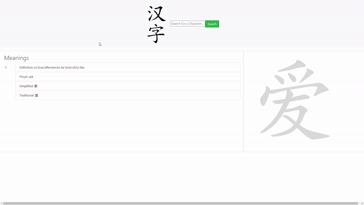

## Table of contents
* [Introduction](#introduction)
* [Technologies](#technologies)
* [Setup](#setup)
* [Final Result](#final-result)

## Introduction
This project is a website which facilitates students of the Chinese langauge. The user inputs a character or word, upon which the definition and properties of the input string are queried and displayed on the webpage. The stroke order is also displayed and animated to facilitate the student in learning to write the character.
	
## Technologies
This website is created using:
* ReactJS version: 17.0.2
* Bootstrap version: 4.5.2
* NodeJS version: 12.16.3
* npm packages: express, cors, nodemon, hanzi, helmet, morgan
* eslint version: 7.26.0
	
## Setup
To run this project, first clone the repo. Navigate to both the client and server folders and run npm start to host the website locally.
```
$ cd learn-hanzi
$ cd server
$ npm install
$ npm run start
```
```
$ cd learn-hanzi
$ cd client
$ npm install
$ npm run start
```
## Final Result
Below you can see a recorded gif demonstrating the website's capabilities and design. Happy learning!

